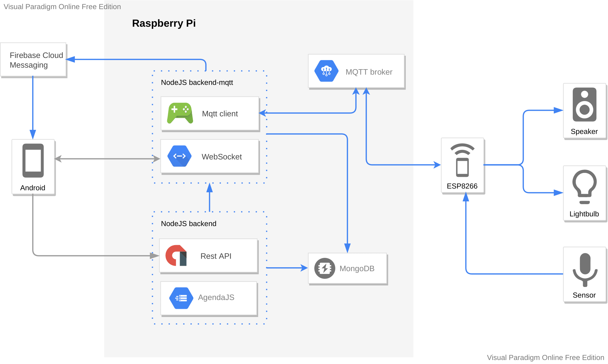
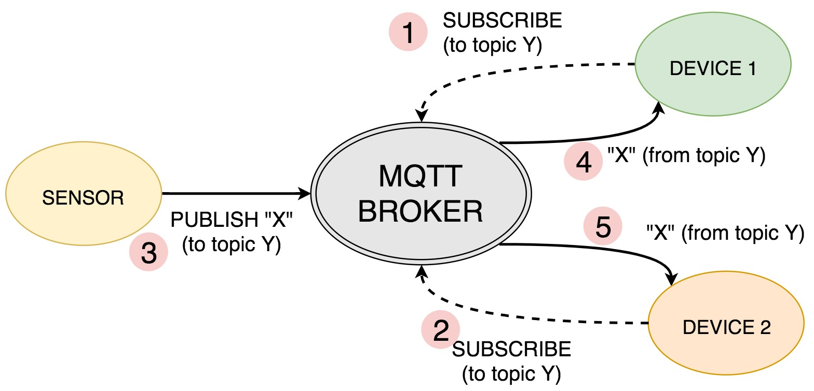

# Představení IoT Platformy

## Webové Rozhraní

[Testovací IoT Platforma](https://dev.iotdomu.cz)

-   zaregistrujte se a řekněte si o přidání oprávnění

## Archtektura

## Technologie

### Frontend

-   React
-   Redux
-   mui
-   Plotify.js

### Backend

-   NodeJS
-   AgendaJS
-   MongoDB
-   InfluxDB - [Testovací InfluxDB](https://influx.dev.iotdomu.cz)
-   RabbitMQ - [Testovací RabbitMQ](https://rabbit.dev.iotdomu.cz)
-   <s>NodeRed - [Testovací NodeRed](https://flow.dev.iotdomu.cz)</s>

### CI/CD

-   Docker
-   Jenkins

## MQTT protokol

